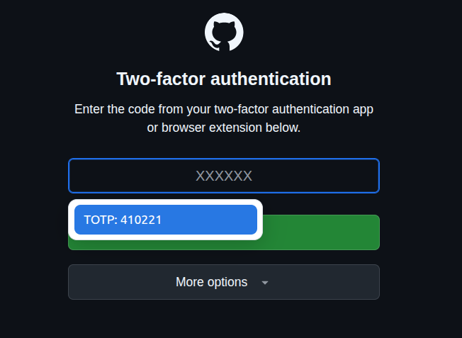
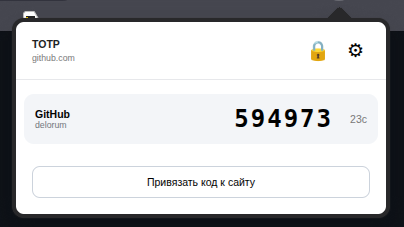

# TOTP-подстановка для Яндекс Браузера

[English version](README.md)

Небольшое расширение Manifest V3, которое локально хранит TOTP-реквизиты, связывает их с точными доменами сайтов и помогает вводить одноразовые коды.

Оно создано для страниц авторизации, где неудобно каждый раз открывать аутентификатор на телефоне. Если для текущего домена настроена привязка, на иконке появляется зелёный `✓`, а рядом с распознанным полем проверки показывается актуальный код. Код также доступен во всплывающем окне расширения.

## Скриншоты

Расширение может показать текущий TOTP-код рядом с распознанным полем двухфакторной аутентификации:



Popup на панели браузера показывает записи, привязанные к текущему домену:



## Возможности

- Импорт JSON-бэкапа «Яндекс Ключа» с полями `name`, `secret` и `techInfo`.
- Добавление одной записи из ссылки `otpauth://totp/...`.
- Изменение локальных подписей сервиса и аккаунта без изменения генерируемого кода.
- Экспорт стандартных TOTP-записей в тот же JSON-формат, который принимает файловый импорт.
- Шифрование базы AES-256-GCM с помощью заданного пользователем мастер-пароля.
- Смена мастер-пароля, явная блокировка и автоблокировка через настраиваемое число минут бездействия.
- Переключение интерфейса между английским и русским языками в настройках; по умолчанию используется английский.
- Привязка одной или нескольких записей к каждому точному домену.
- Распознавание одного поля проверки или группы из 3–10 однознаковых полей.
- Показ кода рядом с полем и подстановка по нажатию.
- Раскрытие раздела **Все коды** в popup для просмотра и копирования любого TOTP-кода с таймером, даже если запись не привязана к текущему сайту.
- Зелёный индикатор на иконке, если для текущего домена доступен код.
- Запуск распознавания полей только на доменах с настроенной привязкой.
- Локальное вычисление SHA-1, SHA-256 и SHA-512 TOTP через Web Crypto API.

## Установка в Яндекс Браузер

1. Клонируйте или скачайте репозиторий.
2. Откройте `browser://extensions`.
3. Включите режим разработчика.
4. Нажмите **Загрузить распакованное расширение** и выберите каталог репозитория.
5. Откройте настройки расширения и создайте мастер-пароль.
6. Импортируйте защищённый backup либо добавьте ссылку `otpauth://totp`.
7. Привяжите запись к точному домену, например `esia.gosuslugi.ru`.

При первом запуске откройте настройки и создайте мастер-пароль до импорта или добавления TOTP-записей. Записи шифруются до сохранения в vault. Требований к сложности нет, но рекомендуется уникальный стойкий пароль. Забытый мастер-пароль восстановить нельзя: потребуется создать новый vault и восстановить базу из защищённого backup.

Удобнее всего создавать привязку непосредственно со страницы сайта, на которой отображается форма ввода одноразового кода: откройте popup расширения и выберите **Привязать код к сайту**. Точный домен этой страницы подставится автоматически.

После изменения исходников обновите расширение на `browser://extensions` и перезагрузите открытые вкладки сайтов.

## Импорт и экспорт

Файловый импорт принимает JSON-массив, совместимый с экспортом «Яндекс Ключа»:

```json
[
  {
    "name": "account@example.com",
    "secret": "BASE32_SECRET",
    "techInfo": "otpauth://totp/Example:account%40example.com?secret=BASE32_SECRET&issuer=Example"
  }
]
```

Экспорт создаёт такую же структуру. Собственная схема `otpauth://yaotp` не является стандартным TOTP, поэтому намеренно не экспортируется и не используется для вычисления кодов.

## Безопасность

- Перед сохранением в `chrome.storage.local` база шифруется с помощью AES-256-GCM.
- Ключ получается из мастер-пароля через PBKDF2-HMAC-SHA-256 со случайной солью и 310 000 итераций.
- Пока vault разблокирован, ключ и расшифрованные записи находятся в `chrome.storage.session`; явная блокировка, таймаут бездействия и перезапуск браузера удаляют их.
- TOTP вычисляется локально; расширение не выполняет сетевых запросов.
- Content scripts не имеют доступа к хранилищу и TOTP-секретам: они запрашивают у service worker только текущий короткоживущий код.
- Код записывается на страницу только после нажатия на подсказку или запись в popup.
- Шифрование защищает скопированный профиль браузера и данные на выключенном компьютере, но не защищает уже разблокированный браузер от вредоносной программы, чтения памяти или кейлоггера.
- Импортированные и экспортированные backup-файлы содержат TOTP-секреты открытым текстом. Их нужно защищать как пароли или резервные коды.

Один стандартный TOTP-секрет можно одновременно использовать в расширении и телефонном аутентификаторе. Оба независимо вычисляют одинаковый код. Удаление или замена TOTP-реквизитов на стороне сервиса сделает недействительными все копии.

## Совместимость

Расширение использует Chromium Manifest V3 и разрабатывается для Яндекс Браузера. Оно может работать и в других Chromium-браузерах, но они пока не тестируются.

## Лицензия

Лицензия пока не выбрана. Все права сохраняются за владельцем репозитория.
